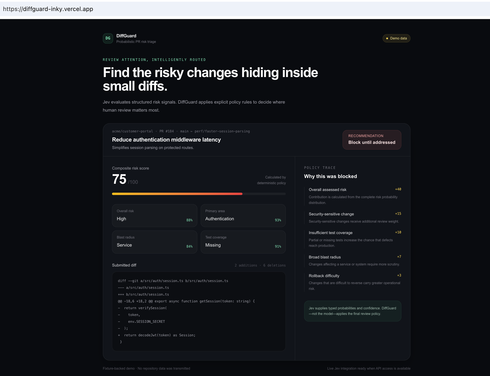
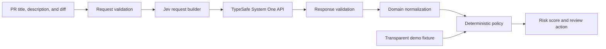

# DiffGuard

**Probabilistic pull-request risk triage for the AI-generated-code era.**

AI can produce code faster than teams can meaningfully review it. DiffGuard explores a different question: instead of generating more code, can AI help route limited human review attention toward the changes that need it most?

DiffGuard uses [Jev](https://typesafe.ai/) to produce typed risk judgments with probabilities and confidence scores. A deterministic policy engine then converts those signals into an auditable review recommendation.

> DiffGuard prioritizes review attention. It does not certify that code is correct or replace human review.

[View the live demo](https://diffguard-inky.vercel.app/)



## Demo

The included demo analyzes a deceptively small authentication change that replaces signed-session verification with token decoding.

Although the diff removes only a few lines, DiffGuard identifies:

- Authentication as the primary change area
- High overall risk
- Service-wide blast radius
- Missing test coverage
- Security-sensitive behavior

The deterministic policy recommends blocking the change until the risks are addressed.

The public demo is explicitly fixture-backed because TypeSafe temporarily paused new signups during the project’s development. Live Jev integration remains implemented behind `POST /api/analyze`.

A deployed fixture-backed demonstration is available at
[diffguard-inky.vercel.app](https://diffguard-inky.vercel.app/).

## Why Jev?

Traditional language models generate open-ended text. Jev is designed to answer structured questions with typed values, probabilities, and confidence.

DiffGuard asks several questions about the same pull-request state in one request:

- What is the overall review risk?
- Which engineering area is primarily affected?
- What is the likely blast radius?
- Are the shown tests adequate?
- How difficult would rollback be?
- Is the change security-sensitive?

The model supplies judgments. Application code retains control of the final decision.

## Architecture



The provider boundary is deliberately isolated:

1. Zod validates untrusted browser input.
2. The request builder creates one multi-question Jev request.
3. The HTTP client handles authentication, timeouts, and provider errors.
4. Zod validates the external response.
5. The normalizer removes provider-specific field names.
6. The policy engine calculates the review recommendation.

## Review policy

The policy uses the complete probability distributions rather than only Jev’s winning choices.

For example, a result that is 51% `high` and 49% `critical` should carry more risk than one that is 99% `high` and 1% `critical`, even though both select `high`.

The score combines:

- Overall risk distribution
- Security sensitivity
- Test adequacy
- Blast radius
- Rollback difficulty
- Model confidence

Explicit safety overrides include:

- Security-sensitive change with missing tests → block
- Material critical-risk probability → block
- Low-confidence assessment → focused human review

The policy is ordinary TypeScript and is independently testable and auditable.

## API

### Live analysis

```http
POST /api/analyze
Content-Type: application/json
```

```json
{
  "title": "Reduce authentication middleware latency",
  "description": "Simplify session parsing on protected routes.",
  "diff": "- return verifySession(token)\n+ return decodeJwt(token)"
}
```

A live request requires:

```dotenv
JEV_API_KEY=your-api-key
JEV_MODEL=jev-latest
```

The API key is read only by the server and is never sent to the browser.

### Fixture-backed demo

```http
GET /api/demo
```

Demo responses contain:

```json
{
  "metadata": {
    "mode": "demo",
    "provider": "fixture"
  }
}
```

This prevents fixture output from being mistaken for a live model decision.

## Error handling

The public API exposes stable application errors without leaking provider response bodies or internal network details.

Handled cases include:

- Invalid JSON
- Invalid or oversized diffs
- Missing server configuration
- Provider authentication failures
- Rate limiting
- Network failures
- Timeouts
- Malformed provider responses
- Unexpected internal failures

## Local development

Requirements:

- Node.js 24 LTS
- npm
- A Jev API key for live analysis

Install dependencies:

```bash
npm install
```

Start the development server:

```bash
npm run dev
```

Open [http://localhost:3000](http://localhost:3000).

The fixture-backed showcase works without an API key.

For live analysis:

```bash
cp .env.example .env.local
```

Then populate `JEV_API_KEY` in `.env.local`.

## Quality checks

```bash
npm test
npm run test:coverage
npm run lint
npx tsc --noEmit
npm run build
```

The test suite covers:

- Request validation
- Jev request construction
- Provider response validation
- Provider error and timeout behavior
- Response normalization
- Deterministic policy branches
- Service orchestration
- Public API error mapping
- Fixture-backed demo behavior

Current test coverage reaches 100% of statements, functions, and lines across the backend modules.

## Project structure

```text
src/
├── app/
│   ├── api/
│   │   ├── analyze/      # Live analysis endpoint
│   │   └── demo/         # Transparent fixture endpoint
│   └── page.tsx          # Minimal showcase UI
├── domain/
│   └── analysis.ts       # Provider-independent contracts
└── server/
    └── analysis/
        ├── demo/         # Demo fixture
        ├── jev/          # Jev adapter and HTTP client
        ├── policy.ts     # Deterministic decision rules
        ├── request-schema.ts
        └── service.ts    # Analysis orchestration
```

## Current limitations

- The showcase uses a fixed demo scenario until new TypeSafe accounts are available.
- Live Jev integration has been contract-tested with mocked provider responses but has not yet been exercised with a production API key.
- DiffGuard accepts pasted diffs; it does not currently retrieve pull requests from GitHub.
- The policy weights are an engineering demonstration, not an empirically calibrated production risk model.
- No model or policy can prove that a pull request is safe.

## Further work

Potential extensions include:

- Live Jev verification when API access becomes available
- A labelled evaluation set of representative pull requests
- GitHub App integration
- Repository-specific policy configuration
- Calibration analysis comparing confidence with reviewer outcomes

## License

DiffGuard is available under the [MIT License](./LICENSE).

## References

- [TypeSafe AI](https://typesafe.ai/)
- [Jev announcement](https://typesafe.ai/blog/introducing-system-one-models-and-jev)
- [TypeSafe API documentation](https://api.typesafe.ai/docs)